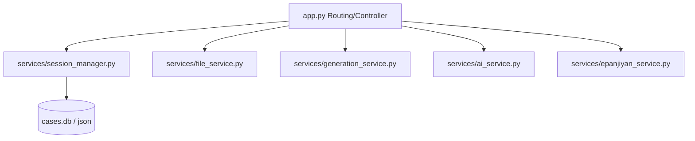

# Refactor Plan: Decoupling and Size Reduction of `app.py` & `case.html`

This document details the architectural plan to modularize the main Flask application controller ([app.py](file:///c:/Users/aksha/Documents/RM%20Generator/RM-Maker/RM-Maker-MAIN/app.py)) and the monolithic client template ([case.html](file:///c:/Users/aksha/Documents/RM%20Generator/RM-Maker/RM-Maker-MAIN/web_templates/case.html)) to enhance maintainability, reduce file sizes, and isolate core business logic from routing.

---

## 1. Current Responsibilities

### app.py (3,140+ LOC, 143 KB)
The file acts as a monolithic controller handling multiple distinct layers:
*   **Routing & HTTP Layer**: Direct endpoint mapping, Flask request parsing, error pages.
*   **Database & Session Management**: Reading/writing Case JSON session stores, locks, and local SQLite `cases.db` connection.
*   **File Management**: Creating bucket folders, handling custom `.docx` uploads, serving preview items, deleting files.
*   **AI Extraction Controller**: Orchestrating `RMDataExtractor` and `SDDataExtractor` prompts, merging state models, handling validation fields.
*   **Deed Generation Logic**: Direct invocation of `docxtpl` compiler, DevLys legacy font translation filters, schema formatting.
*   **Utility Tools**: Transliterator mappings (Sanscript/local API), DevLys-to-Unicode conversion scripts, e-Panjiyan telemetry API endpoint.

### case.html (4,330+ LOC, 262 KB)
A single-page workspace template that integrates three massive functional sections:
*   **DOM Structure**: Configure & Upload bucket layout, splitscreen file preview console, and the full multi-tab Verification Editor.
*   **Inlined CSS (400+ LOC)**: Layout grids, dropzones, KPI tiles, timeline timeline trees, modal overlays.
*   **Inlined JS Script (2,000+ LOC)**: AJAX state synchronization (`saveCase`, `/start_ai`), file upload/delete event listeners, translation hooks, title chain timeline calculations, e-Panjiyan telemetry triggers.

---

## 2. Proposed Modules & Architecture

### Backend Restructuring (`app.py`)
We will extract logic into helper modules while keeping `app.py` strictly focused on route definition and payload serialization.



#### A. Session & Database Service (`services/session_manager.py`)
*   **Responsibilities**: Reading, writing, and locking JSON sessions, directory setup, `cases.db` CRUD operations.
*   **Key Functions**: `load_case_session()`, `save_case_session()`, `list_cases()`, `delete_case_session()`.

#### B. File Operation Service (`services/file_service.py`)
*   **Responsibilities**: Creating bucket folders, upload handlers, file listing/retrieval, file previews helper methods.
*   **Key Functions**: `upload_files()`, `delete_file()`, `get_case_files()`.

#### C. Deed Generation Service (`services/generation_service.py`)
*   **Responsibilities**: Invoking `docxtpl` processors, handling dynamic templates context, applying the Unicode-to-DevLys boundary.
*   **Key Functions**: `compile_deed()`, `preview_deed_draft()`, `devlys_docx_converter()`.

#### D. AI Fact Extraction & Mapping Agent (`services/ai_service.py`)
*   **Responsibilities**: Parsing uploads, executing adapter prompts, structured schema mapping, merging new facts with previous session variables.
*   **Key Functions**: `run_ai_extraction()`, `extract_title_chain()`.

#### E. e-Panjiyan Integration Service (`services/epanjiyan_service.py`)
*   **Responsibilities**: e-Panjiyan extension telemetry variables, valuation payload serialization.

---

### Frontend Restructuring (`case.html`)
The monolithic HTML template will be split by extracting inlined styles, core libraries, and component logic.

```
web_templates/case.html (Main Layout skeleton & Step wrappers)
  ├── static/css/case_workspace.css (Workspace styling, splitscreen, dropzones)
  ├── static/js/case_workspace_core.js (Case variables, Save logic, Step switching)
  ├── static/js/case_workspace_ai.js (AI extraction, Bucket uploads, progress bars)
  └── static/js/case_workspace_timeline.js (Mermaid tree visualization, timeline calculations)
```

---

## 3. Migration Strategy & Phases

We prioritize backend extraction first because Python unit/E2E test pipelines catch compilation and logic regressions much faster than frontend JavaScript splits.

### Phase 0: Create Baseline
*   Run full Playwright regression suite to ensure codebase is clean.
*   Commit current stable state.
*   Tag baseline commit: `git tag v1.0.0-baseline-stable`.

### Phase 1: Low-Risk Backend Extraction
Only extract low-risk backend controllers. Keep function signatures identical, update imports inside `app.py`, and ensure no behavioral changes.

1.  **Extract `services/session_manager.py`**:
    *   Move: `load_case_session()`, `save_case_session()`, case directory creation helpers, and `cases.db` connection helpers.
    *   Import moved functions inside `app.py`.
    *   *Verification*: Run Pytest and Playwright tests.
2.  **Extract `services/file_service.py`**:
    *   Move: Upload routers logic, file listing operations, preview helpers, and bucket directories management.
    *   Import moved functions inside `app.py`.
    *   *Verification*: Run full test suite.
3.  **STOP**: Do not touch AI extraction, document compilers, processors, DevLys conversion, or templates yet. Verify total stability.

### Phase 2: High-Risk Backend Extraction
Extract core processing engines and AI modules:
1.  **Extract `services/generation_service.py`**: Move templates compilation (`docxtpl`), DevLys filters, and preview generator.
2.  **Extract `services/ai_service.py`**: Move structured fact extraction, schema validators, and prompt builder mappings.
3.  **Extract `services/epanjiyan_service.py`**: Move valuation calculations and extension telemetries.
*   *Verification*: Verify logic parity by running E2E case generation test runs.

### Phase 3: Frontend Splitting (`case.html`)
Only after backend services are completely stabilized and isolated, proceed to split the HTML file. Do not convert the CSS/JS frameworks or redesign any UI elements.

1.  **Extract CSS**: Move inline stylesheet blocks from `case.html` to `static/css/case_workspace.css`.
2.  **Extract JS Utilities**: Move standalone helper Javascript functions (e.g. keymaps, basic visual triggers) to `static/js/case_workspace_core.js`.
3.  **Extract JS Workflow Modules**: Move step logic and AJAX triggers to `static/js/case_workspace_ai.js` and `static/js/case_workspace_timeline.js`.
*   *Verification*: Verify page layout, tab switching, and button click responsiveness in Playwright.

---

## 4. Key Risks & Mitigations

*   **Risk 1: Session Collision during AI-Extract Merge**
    *   *Details*: Overlapping file updates can drop data variables if not locked correctly during session file writes.
    *   *Mitigation*: The `services/session_manager.py` must retain the exact locking mechanism currently used in `app.py`.
*   **Risk 2: Broken Context Bindings in Frontend Split**
    *   *Details*: Moving inline JS breaks Jinja2 variables (e.g. `{{ case_id }}`, `{{ doc_type }}`).
    *   *Mitigation*: Declare these variables inside a global script block in `case.html` header, then access them inside the external script files:
        ```javascript
        window.CASE_WORKSPACE_CONTEXT = {
            caseId: "{{ case_id }}",
            docType: "{{ doc_type }}"
        };
        ```
*   **Risk 3: DevLys Encoding / Transliteration Regressions**
    *   *Details*: Hindi text transliteration rely on exact JSON responses and browser event triggers.
    *   *Mitigation*: Verify Unicode to DevLys conversion with regression test cases before and after routing extraction.
