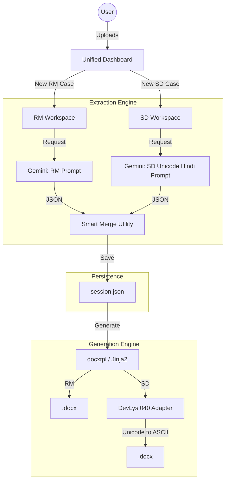
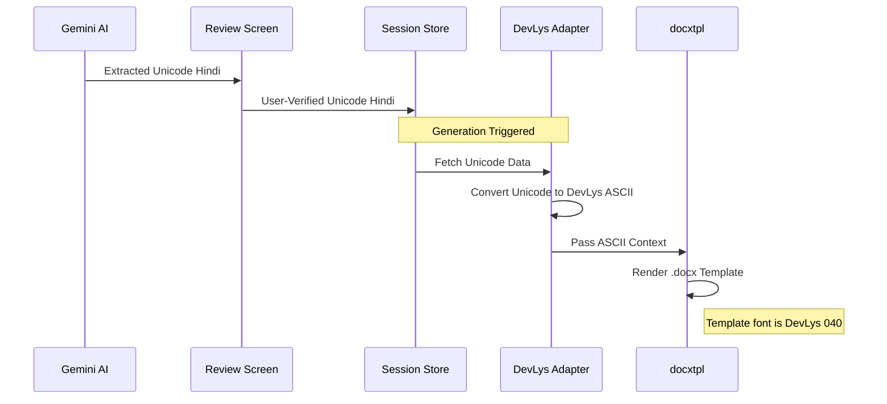

# RM-Maker Integrated Architecture Blueprint

This document defines the high-level architecture for the unified Registered Mortgage (RM) and Sale Deed (SD) processing system.

## 1. System Overview
The system follows a **Modular Document Processing Pipeline** architecture. It separates document ingestion, AI-assisted extraction, and template-based generation into distinct layers, with a specialized **Legacy Font Adapter** for SD workflows.

## 2. Component Breakdown

### 2.1 Unified Dashboard
- **Role**: Entry point for all document types.
- **Responsibility**: Routing users to the correct workspace and managing the case lifecycle.
- **Technology**: Flask + Jinja2 + Bootstrap.

### 2.2 Extraction Engine (`extractor.py`)
- **Role**: Translates physical documents (PDF/JPG) into structured data.
- **Key Feature**: **Context-Aware Prompts**. The engine swaps prompts based on `doc_type`.
- **SD Specifics**: Extracts text strictly in **Unicode Hindi** to ensure downstream readability and reliable transliteration.

### 2.3 Review Workspace (`case.html`)
- **Role**: Human-in-the-loop verification.
- **UI Logic**: Dynamic rendering of tables (Sellers/Buyers vs. Borrowers/Loans).
- **Transliteration**: Real-time English-to-Hindi conversion for SD text fields.

### 2.4 Rendering Engine (`processor.py`)
- **Role**: Injects verified data into Word templates.
- **RM Path**: Standard Jinja2 rendering.
- **SD Path**: 
    1.  Intercepts data context.
    2.  Converts Hindi Unicode strings into DevLys ASCII equivalents.
    3.  Uses `RichText` objects to force the `DevLys 040` font at the XML run level.

## 3. Data Flow: The SD "Bridge"
The architectural challenge of Sale Deeds is the transition from modern Unicode (used by AI and UI) to legacy DevLys (required for final output).

## 4. Key Design Principles
1.  **Immutability of RM**: The RM pipeline remains the "Golden Path." All SD logic is additive or conditional.
2.  **Unicode-First**: All internal processing, AI extraction, and UI state management must use Unicode. Legacy font conversion is a **Terminal Step**.
3.  **Surgical Templating**: Master templates use Word Comments for tags to prevent font corruption and allow easy visual verification.

## 5. Security & Failover
- **Multi-Key Failover**: `extractor.py` handles API key rotation automatically.
- **Credential Protection**: API keys are managed via environment variables and never logged or committed.
