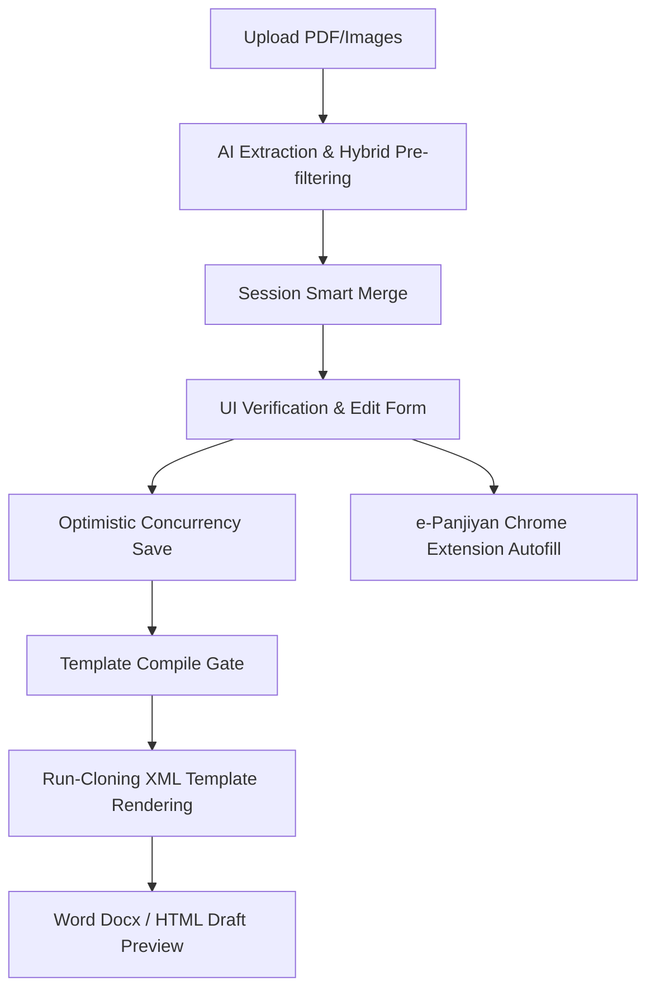

# RM-Maker: Comprehensive Architecture & Code Deep Dive

This document provides a line-by-line and component-by-component structural breakdown of the RM-Maker production legal document automation repository. It details what every module, route, and utility does, how they connect, and how data moves through the pipeline.

---

## 1. System Topology & Pipeline Overview

The codebase is organized as a pipeline that takes raw unstructured KYC uploads, converts them to structured data, handles translation and normalization, and compiles them into Word documents matching strict legal templates.



---

## 2. Core Routing Layer (`routes/`)

The Flask application registers several modular blueprints in `app.py`. These blueprints manage client requests and orchestrate service functions.

### A. Dashboard Controller (`routes/dashboard.py`)
*   **Purpose**: Manages the main workspace interface, phonetic transliterations, and legacy document conversions.
*   **Key Routes**:
    *   `GET /`: Renders `dashboard.html` showing a list of active cases fetched from `list_cases()`.
    *   `GET /devlys-to-unicode`: Serves the font translation converter tool page.
    *   `POST /api/devlys-to-unicode/convert`: Receives a `.docx` file and converts it either from KrutiDev (DevLys) to Unicode, or from Unicode to DevLys, downloading the translated file.
    *   `GET /devlys_keymap`: Exposes the Unicode-to-DevLys font mapping character lists.
    *   `POST /transliterate`: Receives a name or address and returns its phonetic Devanagari transliteration using Google Input Tools API, falling back to a Gemini-2.0-flash-lite call if the API quota is hit.
    *   `GET /api/cases/recent`: Returns case summaries formatted for the browser extension.

### B. Case Controller (`routes/cases.py`)
*   **Purpose**: Governs Case Lifecycle actions: creation, updates, and AI extraction.
*   **Key Routes**:
    *   `GET /new_case`: Instantiates a new case session with a unique timestamp ID, default empty parameters, and redirects to the editor.
    *   `GET /case/<case_id>`: Discovers templates matching the case settings, pads arrays, and loads editing forms.
    *   `POST /case/<case_id>/save`: Saves case fields to disk. Converts Devanagari numbers to English, cleans duplicate salutations, formats addresses, and verifies optimistic concurrency revision counters to prevent overwriting edits.
    *   `POST /case/<case_id>/ai`: Executes AI fact extraction on KYC docs. Uses `select_relevant_pdf_pages` to filter searchable PDFs, calls LLMs to pull structured entities, pairs matching Aadhaar fronts/backs, and merges files using `smart_merge`.
    *   `POST /case/<case_id>/extract_chain`: Summarizes property ownership registries and runs the narrative timeline builder to generate formal Hindi paragraphs.
    *   `POST /api/case/<case_id>/validation`: Triggers the validation framework to list fields warning flags.

### C. Upload Controller (`routes/upload.py`)
*   **Purpose**: Manages files uploads and bucket organization.
*   **Key Routes**:
    *   `POST /case/<case_id>/upload_files`: Uploads raw documents into the case's folder.
    *   `POST /case/<case_id>/upload_bucket/<bucket_name>`: Organizes uploads into separate buckets (`kyc`, `legal`, `ats`, `title_chain`, `ocr`).
    *   `GET /case/<case_id>/file/<filename>`: Serves individual document previews.
    *   `POST /case/<case_id>/delete_file`: Removes uploaded files from the disk.

### D. Generation Controller (`routes/generation.py`)
*   **Purpose**: Handles final compile requests and HTML live previews.
*   **Key Routes**:
    *   `POST /case/<case_id>/generate`: Saves edit state, runs prerequisite checks, and compiles the finalized Word document (`.docx`) through the RM or SD processors.
    *   `POST /case/<case_id>/preview_draft`: Generates an HTML representation of the document, showing live changes directly in the browser's side-by-side split screen.

### E. E-Panjiyan Controller (`routes/epanjiyan.py`)
*   **Purpose**: Interface layer for the Chrome extension autofill portal.
*   **Key Routes**:
    *   `POST /api/case/otp`: Saves OTP codes caught by SMS listeners.
    *   `GET /api/case/otp/recent`: Serves the latest OTP, consuming it.
    *   `GET /api/case/<case_id>/epanjiyan_data`: Returns parsed and restructured fields (like split addresses, gender inference, and claimant/executant roles) tailored for form injection on the Government of Rajasthan's e-Panjiyan site.

---

## 3. Core Business Services Layer (`services/`)

The services layer decouples HTTP request handling from domain-specific legal calculations and files handling.

### A. Gemini SDK Client (`services/ai_client.py`)
*   **Class `AIClient`**:
    *   Initializes the `google-genai` SDK.
    *   Handles **API key rotation**: loops through an array of API keys if quota limit or network errors occur, resuming without interrupting execution.
    *   Provides retry logic with exponential backoff.
    *   Implements `generate_json` (for structured schema extractions) and `generate_text` (for narrative translations).

### B. Prerequisite Compiler Validator (`services/compile_gate.py`)
*   **Functions**:
    *   `check_compile_prerequisites(session, doc_type)`: Scans the session document configuration and ensures all primary fields (e.g. Borrower name, Bank Signatory, Property address, and Execution Date) are populated.

### C. File Manager & Smart Merge Engine (`services/file_service.py`)
*   **Functions**:
    *   `discover_templates()`: Scans the `templates/` folder. Categorizes document layouts (RM under Bank/Borrower/Loan/Property mapping; SD under Seller/Buyer count mapping).
    *   `smart_merge(old, new, verified_fields)`: Recursively merges newly extracted AI fields into existing session files. 
        *   **Crucial Rule**: Any fields marked as "verified" in the UI are **preserved** and never overwritten by new extractions.
        *   Iterates through lists (e.g., sellers, properties, Aadhaar) matching by unique values (`n`, `id`, `adr`) instead of simple indices, preventing duplicate entries during incremental KYC uploads.

### D. Session Lifecycle Manager (`services/session_manager.py`)
*   **Functions**:
    *   `load_case_session(case_id)` / `save_case_session(...)`: Handles read/write actions on `session.json`. Implements cross-platform locking to prevent race conditions during simultaneous edits.
    *   `_clean_case_data(data, doc_type)`: Performs string-level sanitization on name salutations, normalizes address text, and reformats numbers.
    *   `convert_hindi_digits_to_english(data)`: Recursively traverses any data structure to replace Devanagari digits (`०-९`) with English digits (`0-9`) globally.

### E. Document Preview & HTML Renderer (`services/generation_service.py`)
*   **Functions**:
    *   `_render_docx_to_html(template_path, context, doc_type)`: Renders the template with context and converts it to formatted HTML on the fly.
    *   `generate_draft_preview(...)`: Wraps all unverified session values in highlight blocks (`[!!HL_START!!]...[!!HL_END!!]`) before rendering, so they appear highlighted in the HTML preview.

---

## 4. Processing & Extraction Engines (`modules/`)

The modules segment contains the core logic for the Registered Mortgage (RM) and Sale Deed (SD) documents.

```
modules/
├── rm/
│   ├── extractor.py    # AI KYC & KFS extraction for RM
│   ├── processor.py    # Font conversion, padding, docx renderer
│   └── schema.py       # Pruning rules & validation schema for RM
└── sd/
    ├── extractor.py    # AI bucket-based extraction & OCR correction
    ├── processor.py    # Run-cloning, table styling, docx renderer
    ├── narrative.py    # Chain narrative builder and timeline logic
    ├── chain_templates.py # Timeline blueprints mapping
    └── schema.py       # Pruning rules & validation schema for SD
```

### A. RM Template Processor (`modules/rm/processor.py`)
*   **Class `RMTemplateProcessor`**:
    *   Pads borrower, loan, and property arrays to prevent Jinja2 template index errors.
    *   Separates salutations (`Shri`, `Smt`) from names if the template has independent fields, or merges them if not.
    *   `_highlight_paragraph_runs(paragraph)`: Replaces `~~HL~~` tags with yellow background highlights.
        *   **XML Integrity**: Splits XML runs using `copy.deepcopy(run._r)` and sibling node injection via `lxml`, preserving bookmark anchors and drawings.

### B. SD Template Processor (`modules/sd/processor.py`)
*   **Class `SDTemplateProcessor`**:
    *   Implements the same XML run-cloning logic as the RM processor for highlights.
    *   `_apply_mixed_fonts_to_paragraph(paragraph)`: Scans English/Hindi mixed text in paragraphs, splits them, and applies correct fonts (e.g. `Georgia` for English, `DevLys 010` for Hindi) run-by-run.
    *   `_process_payment_tables_on_doc(doc, context)`: Writes seller payment rows into Word tables, ensuring index safety limits to prevent index errors.

### C. SD Narrative Timeline Engine (`modules/sd/narrative.py`)
*   **Functions**:
    *   `generate_chain_narrative(title_chain)`: Evaluates property registry events (allotments, sales, transfers, inheritance), orders them chronologically, deduplicates them, and generates the ownership narrative.
    *   Maps each event type to templates in `modules/sd/chain_templates.py` (e.g., `ALLOTMENT_PLOT`, `SALE_DEED_FLAT`).
    *   Uses Gemini to refine phrasing and transitions, ensuring the final Hindi narrative flows naturally.

---

## 5. Shared Utilities (`utils/`)

### A. Font Transliteration Mapping (`utils/devlys_to_unicode.py` & `utils/devlys_converter.py`)
*   **Classes `DevLysToUnicodeConverter` & `UnicodeToDevLysConverter`**:
    *   Maintains mapping dictionaries for converting between Unicode Devanagari and legacy DevLys (ASCII) encodings.
    *   Processes `.docx` files, parsing paragraphs and tables run-by-run to translate the text while keeping original colors, sizes, and fonts.

### B. Devanagari Font Engine (`utils/helpers.py`)
*   **Functions**:
    *   `Unicode_to_KrutiDev(unicode_str)`: Main font conversion routine. Maps characters, shifts `ि` matras to the left of conjunct consonants, handles reph (`Z`) superscript placement, and corrects common ligatures.
    *   `normalize_relation_prefix`: Reformats relationships (e.g. `Son of` -> `पुत्र श्री`, `W/o` -> `पत्नी श्री`).
    *   `format_indian_currency`: Converts digits to Indian rupee format with proper comma separation (e.g., `6000000` -> `60,00,000/-`).
    *   `select_relevant_pdf_pages`: Extracts text from searchable PDFs using `pypdf`, checks for key legal terms, and selects up to 12 pages (focusing on introduction and signatures) to reduce LLM prompt size.
