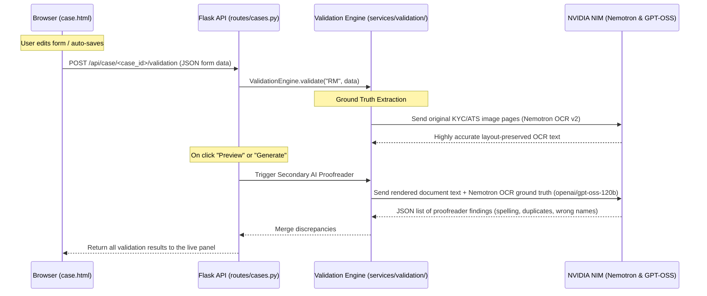

# Design Specification: Smart Role & Entity Validation Engine

This document outlines the design and implementation spec for the live validation engine in RM-Maker. It covers the live validation panel, gender-salutation checks, role matching, NVIDIA NIM-powered post-generation AI proofreader, and logs future improvements (KYC Ingestion & Asynchronous extraction) to prevent losing track of them.

---

## 1. Objectives & Pain Points Addressed
*   **High-Stakes Error Prevention**: Eliminate fatal document generation errors (like incorrect salutations, missing Aadhaar numbers, or mixed-up roles) before documents are submitted to the Sub-Registrar.
*   **Reduced Manual Effort**: Display a live checklist next to the case form so the user can verify document completeness at a glance without manual reading.
*   **Pressure Management**: Reduce stress by providing automated checks and one-click "Auto-Fix" suggestions.

---

## 2. Long-Term Backlog & logged Ideas
To ensure we address all aspects of the operational pipeline, the following ideas are logged here for future development phases:
1.  **KYC Ingestion & Image Preprocessing Pipeline**:
    *   Automatic page rotation (deskew/rotate) for crooked smartphone uploads.
    *   Cropping and brightness contrast adjustments for low-quality Aadhaar uploads.
    *   Improved automatic Aadhaar front/back stitching based on matching visual text.
2.  **Asynchronous Extraction Queue**:
    *   Run PDF/image extraction in a non-blocking background task.
    *   Show dynamic progress bars in the UI so the user can work on other fields while waiting (eliminating the 2-5 min page freeze).
3.  **WhatsApp / Mail Drop Zone**:
    *   A local listener or integration that routes files sent via WhatsApp directly to the active case folder.

---

## 4. Proposed Architecture (Live AJAX Validation & NIM Proofreader)

---

## 5. Backend Validation Enhancements (`services/validation/`)

We will add new validators to `services/validation/` to run alongside the existing `IdentityValidator`:

### A. Gender & Salutation Validator (`gender_validator.py`)
*   **Rules (English / RM focus)**:
    *   If relation prefix is `W/o` $\rightarrow$ Salutation must be `Mrs.` or `Ms.`, and Gender must be `Female`.
    *   If relation prefix is `S/o` $\rightarrow$ Salutation must be `Mr.`, and Gender must be `Male`.
    *   If Salutation is `Mrs.` / `Ms.` $\rightarrow$ Gender must be `Female`.
    *   If Salutation is `Mr.` $\rightarrow$ Gender must be `Male`.
*   **Suggested Fixes**: Provide a `FixAction` in the response payload representing the correct field update (e.g. `{"path": "bs.0.s", "value": "Mrs."}`).

### B. Missing & Critical Fields Validator (`missing_fields_validator.py`)
*   **Rules**:
    *   Checks if critical fields (Borrower Name, Aadhaar ID, PAN, address, relative name, loan amount, execution date) are empty.
    *   Categorizes warnings as `high` (for fields that must be filled) and `medium`/`low` (for optional/recommended fields).

### C. Raw OCR Spelling & Name Cross-Matcher (`name_match_validator.py`)
*   **Problem**: If the AI extracts a value wrong, comparing it against other extracted fields will not catch spelling mismatches.
*   **Rules**:
    *   **Original File Verification (Ground Truth)**: The validator loads the raw text corpus extracted from the original uploaded files (searchable PDFs or image scans) using **NVIDIA Nemotron OCR v2** for 100% accurate, layout-preserved text extraction.
    *   It verifies that the typed names of Borrowers, Co-borrowers, Sellers, and Witnesses can be fuzzy-matched in the original documents. E.g., if a user types `Akshat Sharma` but the raw Aadhaar OCR text contains `Akshat Kumar Sharma`, the system raises a warning: *"Aadhaar card contains 'Akshat Kumar Sharma' but form has 'Akshat Sharma'."*
    *   It checks that the **actual property owner's name** (extracted from the legal report/title deeds) matches either the primary borrower or one of the co-borrowers in the case.

### D. Template Configuration Integrity Validator (`template_validator.py`)
*   **Rules**:
    *   Compares the active case counts in the session (borrowers count, loans count, bank selection) with the filename/parameters of the selected document template.
    *   Warns if a 1-Borrower template is chosen for a 2-Borrower case, or if a different bank's template is selected (e.g. `CHOLA` template for `ICICI` bank).

---

## 6. Post-Generation NVIDIA NIM AI Proofreader (`nim_proofreader.py`)

To ensure absolute zero-tolerance error rates, we introduce an AI-driven proofreading step utilizing **NVIDIA NIM** (free API endpoint).

*   **Integration Details**:
    *   **NVIDIA NIM Endpoint**: `https://integrate.api.nvidia.com/v1/chat/completions` (OpenAI-compatible protocol).
    *   **Proofreader Model**: `openai/gpt-oss-120b` (exceptional accuracy for structured data comparisons and proofreading).
    *   **OCR Ground-Truth Model**: `nvidia/nemotron-ocr-v2` (used on the original scanned files).
    *   **API Key Config**: Stored in `.env` or config:
        *   `NVIDIA_NIM_API_KEY` (Default: `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`)
        *   `NVIDIA_OCR_API_KEY` (Default: `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`)
*   **Image Downscaling Guard**:
    *   To satisfy the cloud endpoint size constraint (`len(image_b64) < 180_000` characters), we will implement an image compression helper using PIL to automatically downscale and compress images to JPEG format until they fit within the payload limit, while preserving text readability.
*   **Proofreading Flow**:
    *   After the `.docx` document is generated, the system extracts the full document text (using `docx2txt` or `python-docx` parser).
    *   It sends a request to NVIDIA NIM `openai/gpt-oss-120b` with:
        1.  The layout-preserved ground-truth text extracted from scanned KYC documents via `nvidia/nemotron-ocr-v2`.
        2.  The full text of the compiled Word document.
    *   **LLM Instructions**: Scan the rendered text and compare it with the session variables and original text. Detect:
        *   Duplicate words (e.g., `Mr. Mr.`, `Rupees Rupees`, `/- /-`).
        *   Names spelled incorrectly compared to original files.
        *   Mismatched variables (e.g., borrower 2 has borrower 1's details in some paragraphs).
        *   Bank template or signatory mismatches.
    *   NIM returns a structured JSON list of proofreader findings which are merged into the UI's Live Validation Panel.

---

## 7. Frontend UI Modifications (`web_templates/case.html`)

*   **UI Layout**:
    *   Add a vertical collapsible sidebar panel on the right side of the case editor screen.
    *   Keep the panel pinned or floating for quick access.
*   **Interactive Checklist**:
    *   **Green Checks**: Passes rules (e.g., "Aadhaar checksum validated").
    *   **Yellow Warnings**: Minor discrepancies or missing recommended fields.
    *   **Red Errors**: High-severity mismatches (e.g., "Borrower 1 salutation is Mr. but relation is W/o") with a prominent **[Auto-Fix]** button. Clicking the button updates the input field in the form and re-triggers validation.
*   **Binding Events**:
    *   Trigger validation check on form load.
    *   Debounce input field changes (300ms) to update validation status live as the user types.
